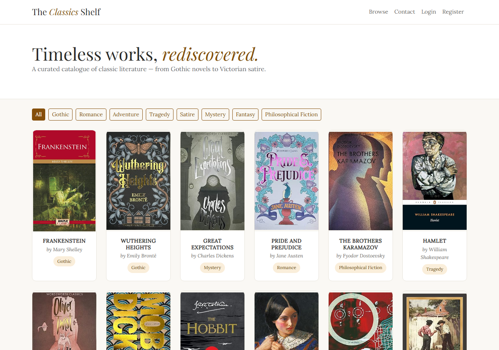
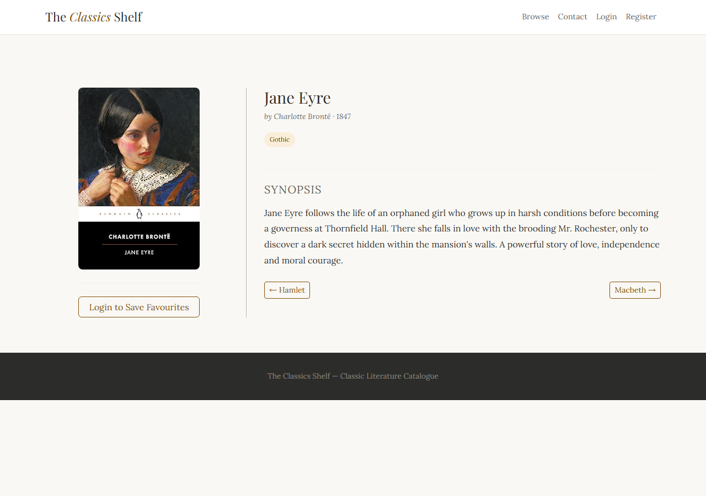

# The Classics Shelf

A book catalogue for classic literature. You can browse the shelf, filter by genre, and make an account to save favourites and add your own books.

I built it on my own in Django for my CSC1025 project (2026). It isn't hosted, so you run it locally. That takes about two minutes, steps are [below](#run-it).



## What you'll see

- **Home page:** every book as a cover card, shuffled on each visit, with genre buttons across the top.
- **Book page:** cover, author, year, genre and synopsis, with previous / next buttons to step through the shelf.
- **After you log in:** a heart to save favourites (they have their own page), plus add-book and delete-book.
- **Contact page** with a validated form, and the Django **admin** at `/admin`.



## At a glance

| | |
|---|---|
| Stack | Django 6.0, Python 3.14, SQLite, Bootstrap 5 |
| Sample data | 18 books across 8 genres |
| Tests | 9 (`python manage.py test`) |
| Hosted | No, local only |

## Run it

```bash
git clone https://github.com/Aj-Boi31/The_Classics_shelf.git
cd The_Classics_shelf

python -m venv venv
venv\Scripts\activate           # Windows
source venv/bin/activate        # macOS / Linux

pip install -r requirements.txt
python manage.py migrate
python manage.py loaddata sample_books
python manage.py runserver
```

Open http://127.0.0.1:8000/. Register an account to try favourites and adding books.

The sample books load **without cover images**, because the cover files aren't in the repo. The screenshots above were taken with covers I'd uploaded locally. When you add a book through the site you can upload a cover.

Want the admin? Run `python manage.py createsuperuser` and go to `/admin`.

## Tests

```bash
python manage.py test
```

The 9 tests check that:
- the genre filter narrows the shelf
- add, delete and favourites need a login
- the favourite heart adds, then removes
- one user's favourites are private from another's
- the book page links to the next book and returns a 404 for a missing one

## How it's built

```
book_project/   settings, urls
books/          models, views, forms, admin, tests, sample data (fixtures/)
accounts/       register, login, logout
templates/      base and page templates
```

**Models**
- `Genre`: name
- `Book`: title, author, year, genre, description, cover image
- `Favourite`: user + book, `unique_together` so you can't save the same book twice

**Things I used**
- Class-based views (`ListView`, `DetailView`, `CreateView`, `DeleteView`) with `LoginRequiredMixin`
- `get_queryset()` for the shuffle and genre filter, `get_context_data()` for favourite status and prev / next
- `@login_required` on the favourite toggle
- Django's built-in auth forms
- `ImageField` + Pillow for cover uploads
- A customised admin with search, filters and ordering

## What's missing

- Not deployed.
- No search box, only the genre filter.
- Only 18 books, and no covers in the sample data.
